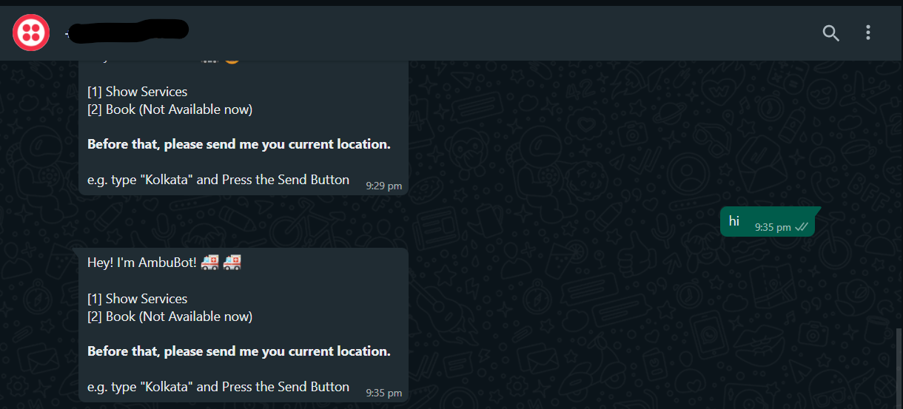

# AmbuBot

The website project aims at providing available ambulances at urgent hours located in nearby hospitals. Booking an ambulance and reaching at doorstep is the motive behind helping people in Covid-19 crisis. The project covers two aspects together- Earning money (As a business model) and giving something to community. On one hand, where the project can earn money by acting as a middle men between the needy patients and hospitals, on the other side, it acts well on humanitarian grounds by helping those in need. Hence, the project is reality feasibe.

The code sample consists of a bot and a website from where the bot can be accessed. The Bot works within WhatsApp and this helps us to get reliable ambulance leads and call the ambulance to take our dear ones to save their lives. There is a local JSON database from which we draw the location which is provided by the user, then the main function is activated which extracts the sender's phone number , receiver's phone number (Twilio API bot number) and prints the message body. Followed by that, the Beautiful Soup Python Web Scrapper fetches data from multiple trusted databases and finally returns the strings to the Twilio API which is again forwarded by the Bot as the nearest reliable Ambulance leads.

## Tech Involved
- [Python](https://www.python.org/)
- [Twilio](https://www.twilio.com/)
- JSON Local Database
- Cloud

## Things we learned
- Twilio API
- Beautiful Soup
- Web Scrapping
- Integration of the BOT with WhatsApp

## Installation
1. Set all the environment variables (CREDENTIALS)
2. Setup the Python Dev Env.

```
$ python -m venv textenv
$ .\textenv\Scripts\activate
```
3. Install the dependencies.
```
$ pip install -r req.txt
```
4. Run the Bot
```
$ python ambubot.py
```
5. Cleanup when you're done. Deactivae the Dev Env.
```
$ deactivate
```


## Usage

